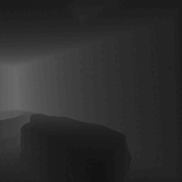
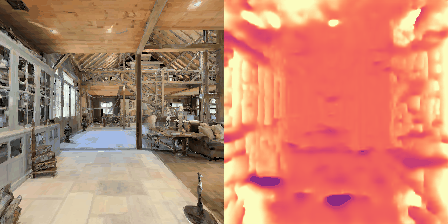
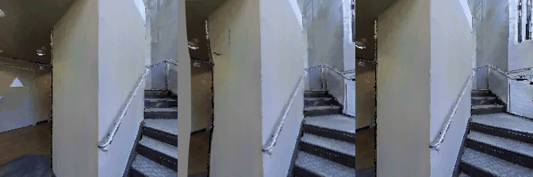

# 16726 - Learning-based Image synthesis - Final Project 

### SemSyn: Semantics-driven View-Synthesis 

This code contains the implementation for the final project of 16-726.

<div align="center">
    
</div>

The backbone of the code is based on this [repo](https://github.com/ClementPinard/SfmLearner-Pytorch) 
which implements the following paper: 

**Unsupervised Learning of Depth and Ego-Motion from Video** by
[Tinghui Zhou](https://people.eecs.berkeley.edu/~tinghuiz/), 
[Matthew Brown](http://matthewalunbrown.com/research/research.html), 
[Noah Snavely](http://www.cs.cornell.edu/~snavely/), 
[David G. Lowe](http://www.cs.ubc.ca/~lowe/home.html)

For our project, we:
- Extend the framework to perform view-synthesis and Structure-from-Motion on indoor environments.
- Provide instructions and utility code needed to generate the indoor dataset.
- Extend it to support semantic labels as inputs for predicting depth information.
- Extend the supported loss functions.

## Requirements and setup
This code was tested with Pytorch 1.11.0, CUDA 11.4 and Ubuntu 18.04. We 
followed the setup below: 

```bash
conda create -n sfm python=3.7
conda activate sfm
pip install -r requirements.txt
```

## Preparing the dataset 

We used the Matterport3D ([MP3D](https://niessner.github.io/Matterport/)) dataset for 
our project and the [Habitat](https://aihabitat.org) simulation environment to 
generate egocentric trajectories for training, validation and testing. 

<div align="center">
    
    
    
</div>

### How to get the Matterport3D dataset?

##### Scenes:
We use the MP3D's scene reconstructions. The official Matterport3D download script 
(`download_mp.py`) can be accessed by following the instructions [here](https://niessner.github.io/Matterport/). 
The scene data can then be downloaded:
```bash
# requires running with python 2.7
python download_mp.py --task habitat -o data/scene_datasets/mp3d/
```

We extracted it such that it has the form `data/scene_datasets/mp3d/{scene}/{scene}.glb`.
There should be 90 scenes.

##### Trajectories:
We use the Vision-Language Navigation in Continuous Environments ([VLN-CE](https://jacobkrantz.github.io/vlnce/)) 
dataset for getting the ego-centric trajectories. We used the ```R2R_VLNCE_v1-3_preprocessed``` 
version of the dataset from their [repository](https://github.com/jacobkrantz/VLN-CE).
We extracted it such that it has the form `data/R2R_VLNCE_v1-3_preprocessed/{split}/{split}.json.gz`.

##### Simulator:
We used the [Habitat-Sim](git@github.com:facebookresearch/habitat-sim.git) and 
[Habitat-Lab](git@github.com:facebookresearch/habitat-lab.git) to prepare de dataset.
To install them, run:

```bash
# this is habitat-sim
conda install -c aihabitat -c conda-forge habitat-sim=0.1.7 headless

# this is for habitat-lab
git clone --branch v0.1.7 git@github.com:facebookresearch/habitat-lab.git
cd habitat-lab
python -m pip install -r requirements.txt
python setup.py develop --all
```

##### The actual data we used:
Finally, in ```data/habitat_extension``` we provide the code we used to generate
the data we used in this project. Run it as:
```bash
python data/habitat_extension/run.py --exp-config data/habitat_extension/mp3d.yaml
```
The code should generate color, depth and semantic images, and pose information 
for each trajectory, as shown in the gif above. 

##### Post-processing steps:

Some additional post-processing steps was performed. These steps include switching color channels, converting the semantic 
images to labels, adding intrinsic parameters to the dataset, and analyzing trajectory statistics for the ego motion.
None of these post-processing steps require the simulator.
- Switching Color Channels <br>
The red and blue channels are swapped in the generation of the RGB output during the trajectory training, therefore,
they need to be swapped back in order to form the right RGB image sequence. This is achieved in the file convert_bgr_to_rgb.py.
Each BGR image in the directory is converted into an RGB image using CV2's cvtColor functionality. The corrected RGB
images then overwrite the old BGR images and this directory of RGB images can then be turned into a GIF. <br>

- Converting Semantic Images to Labels <br>
Generated output GIFs were also labelled using semantic labelling. This was done in generate_semantic_masks.py. Each image in
the GIF outputs were masked with a semantic mask. Each of the masked areas of pixels were replaced by a specified associated color.

- Compute Trajectory Statistics <br>
The trajectory statistics of generated ego motion were also analyzed. In particular, total number of environments, total
number of trajectories, and average, min, and max trajectory lengths for each environment were calculated. This was done in
compute_statistics.py. Total number of environments was calculated by counting the number of directories under each condition
val_seen, val_unseen, and train. These environment directory names are similar to randomly generated keys in appearance. Total number of
trajectories was calculated by summing up the total number of directories that were under each of the environments in the three
conditions val_seen, val_unseen, and train. These trajectory directories were named using numbers. Average, min, and max
trajectory lengths were computed using python inbuilt .mean, .max and .min functions.

- Adding Intrinsic Parameters to the Dataset <br>
The associated intrinsic camera transform was saved into the directories of each of the RGB ego motion GIFs generated. 
The code that performs this can be found in add_intrinsics.py.

## Training
During the training stage, the model predicts depth and pose information through a view-synthesis loss. Based on previous work,
there were two networks that required training–the pose network and the depth network. The depth prediction network interprets the inputs
from the RGB-encoder network and the semantic network into an applicable depth map.
<br>
The pose network predicts the pose transformation between a view at time t=n and a view at time t=n+1. The predictions are
warps between timeframes. 
<br>
Each environment and trajectory was trained for a total of 50 epochs due to time and resource constraints. Additional epochs
of time were added as time allowed.

Training can be done using the following command:
```bash
python train_mp3d.py data/mp3d_sfm/ --log-output --mask-loss-weight 0.0 --with-semantics --batch-size 16
```


## Evaluation
During the inference stage, the model is given an input image and a desired set of poses, and uses projective geometry 
and the predicted depth to synthesize the new viewpoints. 

Pose inference can be run using the following command:
```bash
python run_pose_inference.py --pretrained-disp checkpoints/mp3d_sfm/exp1_04-26-23:56/dispnet_model_best.pth.tar  --pretrained-pose checkpoints/mp3d_sfm/exp1_04-26-23:56/exp_pose_model_best.pth.tar  --output-dir out/exp1_val/vs_unseen
```
And depth inference can be run using the following command:
```bash
python run_depth_inference.py --pretrained bach/checkpoints/mp3d_sfm/04-26-23:56/dispnet_model_best.pth.tar  --dataset-dir data/mp3d_sfm/val_unseen  --output-dir exp1_val/depth_unseen --with-disp --with-depth
```


## Pretrained Nets

[Avalaible here](https://drive.google.com/drive/folders/1H1AFqSS8wr_YzwG2xWwAQHTfXN5Moxmx)

Arguments used:

```bash
python3 train.py /path/to/the/formatted/data/ -b4 -m0 -s2.0 --epoch-size 1000 --sequence-length 5 --log-output --with-gt
```

### Results
The following depth GIF results were obtained on new testing data after training the models.
<br>
<div align="center">
    
</div>
This GIF shows a depth "heatmap" of a given traversal in a given environment. The results are not the clearest when compared
to the ground truth to the left of it, however, you can still make out the environment.
<br>
<div align="center">
    
</div>
This GIF is an example of output generated when the model has been trained directly on the ground truth. There are some 
warping issues, but it is still clear what the environment is and where the trajectory of the ego motion is going when
compared to the ground truth.
<br>
<div align="center">
    
</div>
This GIF is an example of output generated when the model predicts the next frame of the image. This results in even more
noticeable warping issues during certain segments of the GIF, but it is still pretty clear what the environment is and where
the trajectory is going.

<br>
<br>
Here were the trajectory statistics obtained after training the pose network.

| Split | Number of Scenes | # Trajectories/Scene | # of Total Trajectories | # steps/Trajectory |
|-------|------------------|----------------------|-------------------------|--------------------|
| Train | 33               | 65                   | 2169                    | 55 / 119,976       |
| Val   | 28               | 5                    | 142                     | 54 / 7750          |
| Test  | 11               | 55                   | 613                     | 54 / 33,412        |


## Conclusion and Future Goals
In short, SemSyn works reasonably well in generation of ego motion based on the indoor scenes and trajectories given by the
MatterPort3D dataset. We believe that the model would be even more accurate at portraying these indoor trajectories if they
were given even more training time.
Some things that we can try going forward include:
- 3D point loss
- Improve multi-scale loss

## Other Implementations
[TensorFlow](https://github.com/tinghuiz/SfMLearner) by tinghuiz (original code, and paper author)
